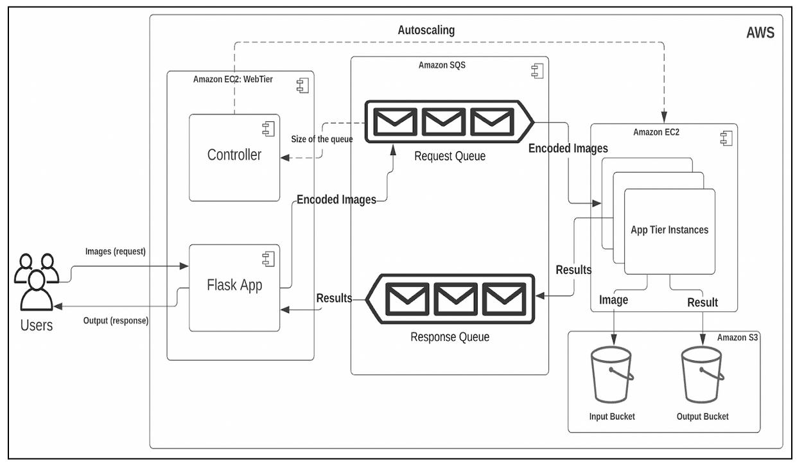

#  Face Recognition as a service

### Description

In this global era of modern computing, it is necessary to efficiently provide the solution to the asked problem in a cost-efficient and robust way. Cloud services providers such as AWS, Microsoft Azure, et al provide such facilities to deploy our service (or software) on seemingly infinite resources. At the same time, it is essential to meter these available resources and to continuously monitor them in order to avoid the overuse of resources. If left unmonitored, it is highly likely that it may increase the cost associated with the use of resources. This project is created to handle multiple client requests at the same time with elastically scaling cloud resources that dynamically scale themselves on demand in a cost-efficient manner. The service we implemented using AWS resources will be able to recognise the face image uploaded by the end-user to the application we deployed. It will be able to instantiate and run the multiple EC2 instances concurrently to process a large number of inputs as rapidly as possible. This autoscaling feature we implemented will let the application utilize the capabilities of the cloud to perform thriftily and accurately.

### Workflow

##### Web tier

As described in the image above, A web tier was implemented on one of the Amazon EC2 instances mainly handling these two tasks. Both of them get invoked automatically through systemctl and cronjob:

- Flask Application: The flask deployment application (a framework of python) is implemented to handle the GET and POST HTTP requests. When a user sends/uploads the image file, the flask application renders the relevant GET/POST methods and receives the image sent over the internet. This image gets converted into the stream and gets encoded to base64. Further on, a string message is created consisting of the file name and encoded message and is sent to the SQS request queue. Now, this request is submitted to SQS waits asynchronously to be processed and remains on a waiting period until the respective output of the image file is not received from the app tier. After receiving the respective response from the server, the flask application returns the output to the user and deletes it from the SQS response queue.  Additionally, several other functions for purging the buckets and queues are also implemented in the flask application to conveniently reset the buckets and queues. In this flask application, boto3 SDK external dependency is used in order to interact with the AWS resources.
- Controller: The python-based code is used to implement the controller that implements the autoscaling logic. This controller gets invokes as soon as the web tier is started, and continuously checks the statuses of the app-tiers, and queues to perform the autoscaling logic. The main target of this code is to implement autoscaling logic that is explained explicitly below.

##### App tier

The app-tiers are implemented in python language that does the main part of the whole project. In order to get this working, a replica instance of the given AMI was created that consisted of face recognition algorithms provided by the professor. In this instance, boto3, base64 and PIL dependencies were installed. After installing these components, our code was deployed, which works along with the given face_recognition file. The deployed code continuously reads the request queue for the images to be processed. A single app-tier retrieves the first message from the queue and hides it for 30 seconds in order to avoid repetition processing. This retrieved message is split into two parts, file name and encoded message, sent from the web tier. Now this encoded message is decoded and gets converted into an image, in order to make the predictions. This image is saved to the S3 input bucket. Now this image is passed to the face_recognition file to make the predictions. The output from this file is saved to the variable and is appended with the filename. This filename and output are sent to the response queue for the web tier to get the result. Additionally, this filename as a key and output as a value is also stored in the output bucket. After successfully completing the all above-mentioned steps, the request message from the request queue is deleted and the program again continuously checks for the message in the request queue. If a message is received, it again performs the above-mentioned steps. If the queue is empty, then it waits for 5 seconds and checks again for the message. This way, it continuously checks for the message and processes it when received. In order to run this script automatically without user interaction, a shell script is generated that invokes the python code on every start and every reboot. 
For creating 19 similar instances, an AMI of this working code was generated and instance replicas from this AMI were created.

##### Autoscaling

As stated above, the controller file does the autoscaling job. It continuously checks the status of the instances and the number of messages in the request queue. Here, for the messages in the queue, it takes the number of all the messages in the queue Visible and NotVisible. Then it checks for the total number of running and stopped instances. 
Here one catch is, that it takes a few seconds (more than 30) to start an instance and stop an instance, and in this scenario, an instance goes to the ‘pending’ or ‘stopping’ state which may work inconsistent according to the autoscaling logic. For handling this, a function was implemented that checks whether the instance is not in the ‘pending’ or ‘stopping’ state. If so, the logic implemented does not process that instance and skip that instance for 30 seconds to change its state to an appropriate ‘stopped’ or ‘running’ state. 
For the normal scenario, the controller checks if the number of messages is more than the number of active ‘running’ instances or not. If the number of messages is more than the number of active ‘running’ instances, it calculates the difference between them and starts that many instances. For example, if we have a total of 14 messages in the queue and 6 instances running, then, in this case, it will calculate 14 messages - 6 running instances = 8. It will start 8 more instances to get the rest 8 messages processed but here, we have set the limit to 19 total running instances only. So before starting the instances, it will check whether the number of running instances is not exceeding the limit of 19. If so, it will not start any new instance but, only wait for the messages to be processed by app-tiers and get deleted by them. For example, if we have a total of 48 messages in the queue and 17 instances running, then, in this case, it will calculate 48 messages - 17 running instances = 31, here it will find the minimum of (31) and (allowed active instances 19 - running instances 17 = 2), so it will start 2 instances only. In this way, it scales out the instances.
On the other hand, If the number of messages is less than the number of active ‘running’ instances, it calculates the difference between them again and stops that many instances. For example, if we have a total of 4 messages in the queue and 16 instances running, then, in this case, it will calculate 4 messages - 16 running instances = -12 (absolute value 12). It will stop 12 instances. In this way, it scales in the instances.
All the above-mentioned tasks run continuously without any kind of user interaction. The controller program (in which this autoscaling logic is implemented) gets invoked automatically on start and reboot by the systemctl and cronjob.

### Code Workflow

- Once the web tier instance of EC2 is in running status, the controller.py file is automatically executed. We start the server manually. Now, once the server starts, the user can send multiple images for processing. These images are received by webv2.py which encodes the images, sends them in the request queue (req) and waits for the result.
- The controller.py continuously checks for the messages in the request queue and starts or stops the EC2 instances as per requirement.
- Now, the messages from the request queue are received by index.py which decodes the message and sends the decoded image to face_recognition.py for processing. 
- After receiving the output from face_recognition.py, index.py stores input inside the input bucket (ip34) and outputs to the output bucket (op34) of S3. It also, simultaneously, sends the output of the response queue (res) and deletes the message from the request queue.
- This output is received by webv2.py which extracts the message from the response queue, deletes it from the queue and returns it to the user.

#### Contributors

- [Subham Kumar](https://www.linkedin.com/in/subham-gc7784)
- [Kenil Patel](https://www.linkedin.com/in/kenil-patel-0101/)

